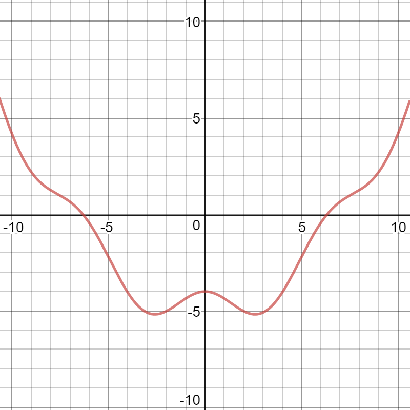
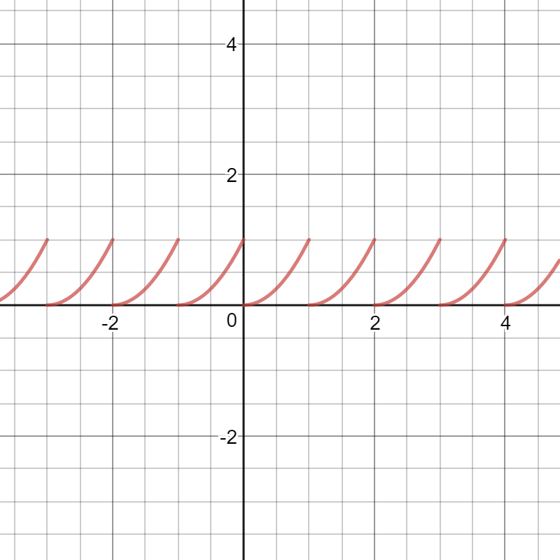
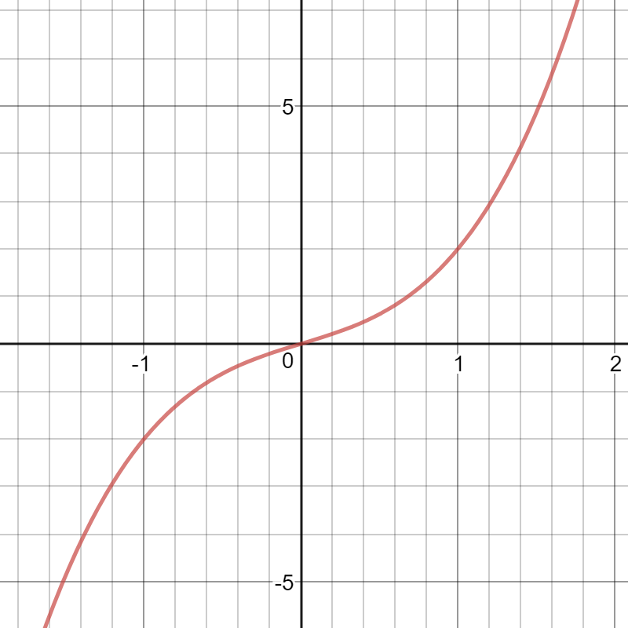
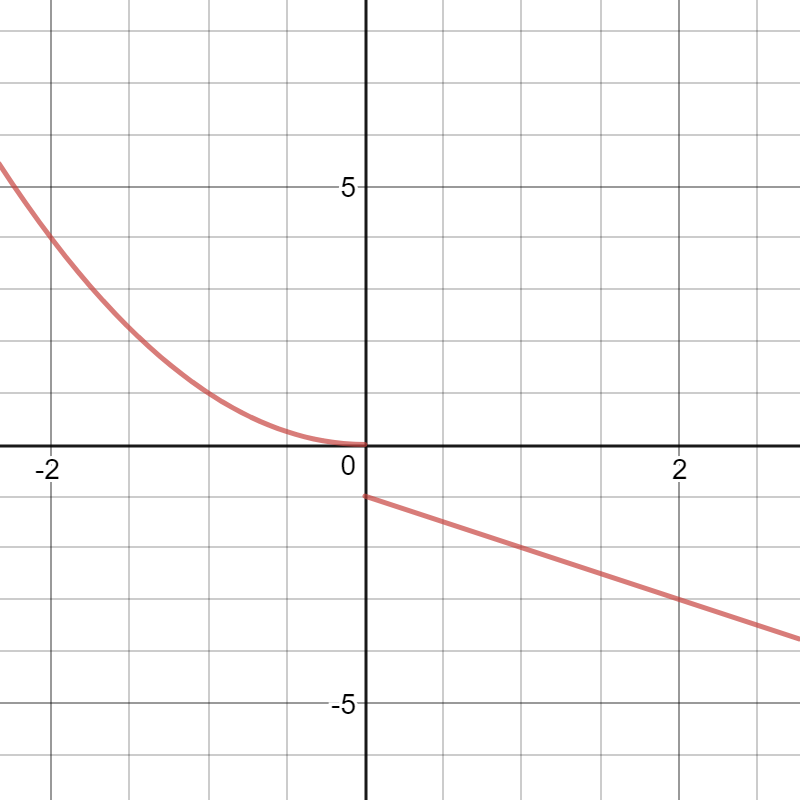

# Properties of Functions

## Domain, Codomain and Range

In the previous section we defined a function $f: A \rightarrow B$ to be a mapping from the set $A$ to the set $B$. If $x \in A$, we call $x$ an input of the function, and we defined $f(x) \in B$ to be the corresponding output. We say that $A$ is the domain of the function $f$, and we require that each element of $A$ to have exactly one output. We call $B$ the codomain of the function $f$.

For example, if $f$ is the function that takes a number and returns its square root, then we can write $f(x) = \sqrt{x}$. Since we are not able to take the square root of negative numbers, a suitable domain for $f$ is the set $A=\\{x \in \mathbb{R} \| x\geq 0 \\}$. Since $\sqrt{x}$ is a real number for all $x\in A$, a suitable codomain is $B=\mathbb{R}$.

But that raises the question of whether or not there are elements in the codomain that have a corresponding output. The answer is *not necessarily*. We have that $-1$ is an element of $B$, but there is not $x\in A$ such that $\sqrt{x} = -1$.

This leads us to the concept of **range**. The range of a function is the set of all possible outputs. More precisely, the range is defined by $R=\\{y \in B \| f(x) = y \text{ for some } x\in A \\}$. It should be thought of as a subset of the codomain.

The difference between the codomain and the range of a function is perhaps a subtle one. The range is something the follows carefully and exactly from the definition of the function, while the codamin is a bit looser. All that's required of the codomain is that it contains the range. This can be convenient in cases where it's difficult or tedious to determine all the possible outputs of a function. Rather than going through that trouble, we can define the codomain to be something generous that we know contains all possible outputs, with the understanding that not every element in the codomain corresponds to an input.

So then if $f(x) = \sqrt{x}$, we can say that the range is $R=\\{x \in \mathbb{R} \| x\geq 0 \\}$. To see this, we get $y=f(x)$ and try to see which values of $y$ can be obtained. Squaring both sides of $y=\sqrt{x}$, we obtain $y^2 = x$ is neither $x$ or $y$ are negative. So indeed, if $y$ is any nonnegative number, plugging $y^2$ into $f$ gives us $f(y^2) = \sqrt{y^2} = |y| = y$. Since the square root of a number is never negative, we know thta $y$ cannot be negative. So indeed, $R$ is the range of $f$. While we took the codomain of $f$ to be $\mathbb{R}$, any set that contains $R$ would also be acceptable: say $\{y \in \mathbb{R} | y > -1 \}$ or even $R$ itself.

Given the graph of a function, we can determine the domain and range. The number $a$ is in the domain if and only if when we draw a vertical line at $x=a$, the line intersects the graph once (and only once). The number $b$ is in the range if and only if when we draw a horizontal line at $y=b$, the line intersects the graph at least once.

`We can do an example here, something like x/(x+1) for instance`

## Even and Odd Functions

>Definition:
>
>A function $f$ is called **even** if $f(x) = f(-x)$ for all $x$ in the domain of $f$. 
>
>A function $f$ is called **odd** if $f(x) = -f(-x)$ for all $x$ in the domain of $f$.

Thinking in terms of graphs, an even function is one where the $y$-axis acts in some way like a mirror. Put another way, if we had the graph printed on a piece of paper, and we folded the paper where the $y$-axis is, the graphs on either side of the $y$-axis would line up.

The following is a graph of an even function:

The graph can be found [here](https://www.desmos.com/calculator/muql8ewwkz).

Note the symmetry. The graph for positive $x$ values is the same for negative $x$ values, just reflected. We have, for example, $f(5) = f(-5)$ and $f(3) = f(-3)$, which agrees with the definition of what it means for a function to be even.

The graph of an odd function is one where if we reflect it about the $y$-axis and then the $x$-axis, we get the same graph back. As an example, the following graph is of an odd function:

The graph can be found [here](https://www.desmos.com/calculator/b8qi72b6dm).

Here, we can see a different kind of symmetry. If we look at $f(6)$, for instance, we see that $f(-6)$ has the opposite sign.

In a certain sense, the graphs of even or odd functions give us redundant information. If I showed you the graph of an even function for positive $x$ values, you could construct the graph for negative $x$ values. All you'd have to do is draw the mirrored image. Similarly, if I showed you the graph of an odd function for positive $x$ values, you could construct the rest of the graph. You'd just draw the same curve reflected about the $y$-axis and then the $x$-axis (or about the $x$-axis and then the $y$-axis).

## Periodic Functions

>Definition:
>
>A function $f$ is called **periodic** if there exists a positive number $T$ such that $f(x) = f(x+T)$ for all $T$. The value of $T$ is called the $period$ of the function.

Intuitively, periodic functions are ones that repeat themselves. If I told you what $f(x)$ is for all $x \in \[0,T)$, then you could tell me $f(x)$ for any value of $x$.

For example, the following function is periodic with period $1$:

The graph can be found [here](https://www.desmos.com/calculator/afautxqng2).

The formula typed into Desmos is just a trick that you don't need to worry about.

The function is defined as $f: \mathbb{R} \rightarrow \mathbb{R}$, where $f(x) = x^2$ if $x \in \[0,1)$ and $f(x) = f(x+1)$ for all $x$. To determine the value of $f(5/2)$, we note that $f(5/2) = f(3/2 + 1) = f(3/2) = f(1/2 + 1) = f(1/2) = (1/2)^2 = 1/4$. That is, we can keep subtracting integer multiples of the period off from the input until we get a new input in the interval that we know.

## Increasing and Decreasing Functions

>Definition:
>
>A function $f$ is said to be **increasing** if $f(b)>f(a)$ whenever $b>a$.
>
>A function $f$ is said to be **decreasing** if $f(b)<f(a)$ whenever $b>a$.

If $f$ is an increasing function, and we consider the graph of $y=f(x)$, then the statement $b>a$ can be interpreted to mean that $b$ is a value on the $x$-axis that is farther right than the value $a$ on the $x$-axis. The statement $f(b)>f(a)$ can be interpreted to mean that $f(b)$ is a value of the $y$-axis that is higher than the value $f(a)$ on the $y$-axis. So "increasing" means what we might intuitively think: a function is increasing if the graph moves up as we move to the right.

Similarly, a function is decreasing if the graph moves down as move to the right.

The following is the graph of $y=f(x)$, where $f(x) = x^3+x$.

The graph can be found [here](https://www.desmos.com/calculator/zxnqnddokc).

The function $f$ is an increasing function. Indeed, looking at the graph, we see that it goes up as we move to the right.

Although the graph is very suggestive, it's best to actually prove that $f$ is increasing from the definition. We can use graphs to help shape our intuition, but we should avoid making definitive statements just from a picture. Pictures are at best approximations to what's actually going on.

Let $a$ and $b$ be real numbers such that $b>a$. We want to show that $f(b)>f(a)$. That is, we want to show $b^3+b > a^3 + a$. `I'm not sure if this is the kind of stuff I want to do, I'll check back in later`

The following is the graph of $y=g(x)$, where $g$ is defined by

$$g(x)= \left\\{ \begin{array}{ll} x^2, & \mbox{if } x\leq 0, \\ -1-x, & \mbox{if } x > 0. \end{array} \right.$$

The graph can be found [here](https://www.desmos.com/calculator/yfx7kecm0b).
